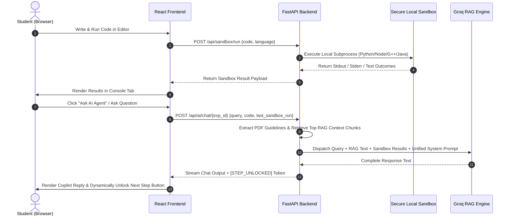

# 🔬 VirtuaLab: AI-Copilot Virtual Laboratory Environment

[](https://fastapi.tiangolo.com)
[](https://reactjs.org)
[](https://vitejs.dev)
[](https://groq.com)
[](https://judge0.com)

**VirtuaLab** is a next-generation, AI-agent guided, virtual laboratory environment designed to elevate practical computer science learning. Featuring integrated multi-language code sandboxes, contextual syllabus-trained RAG AI pairs, and step-by-step cryptographic verification paths, VirtuaLab eliminates complex local setup barriers and brings pair-programming support directly to students.

---

## 👥 Team Collaborators

Meet the minds behind VirtuaLab:

*   **Prajwal Hage** (Lead Architect & Developer) — [GitHub Profile](https://github.com/Prjhage)
*   **Om Shrigiriwar** (Core Engineer) — [GitHub Profile](https://github.com/om67891)
*   **Prasad Pawar** (Systems Engineer) — [GitHub Profile](https://github.com/Prasadpawar21)
*   **Sakshi Salvi** (UI/UX Designer) — [GitHub Profile](https://github.com/sakshisal)
*   **Aniket Shinde** (Full Stack Engineer)

---

## ❓ Problem Statement

Practical computer science learning currently suffers from three fundamental bottlenecks:
1.  **Environment Friction**: Setting up development environments (Docker containers, GCC compilers, database adapters, Node environments) often takes hours. Students frequently get stuck on machine-specific configuration errors rather than actual programming logic.
2.  **Lack of Real-Time Guidance**: When students face syntax, logic, or execution exceptions in laboratory experiments, teachers cannot physically assist everyone simultaneously. Students stall, lose momentum, or copy answers from external sources.
3.  **Passive Assessment**: Standard laboratory verification portals only execute final code submissions. They fail to assess the conceptual path, command execution progression, or understanding of background resource materials.

---

## 💡 Proposed Solution

**VirtuaLab** introduces a unified, interactive laboratory operating system that bridges the gap between sandboxed execution and intelligent tutor guidance:

*   **⚡ Secure Integrated Sandboxes**: Run Python, JavaScript, C++, and Java solutions directly inside the browser using a high-performance, secure backend local sandbox engine. No local student machine compiler setup required.
*   **🤖 Groq-Powered AI Copilot Agent**: An intelligent virtual lab assistant always active on the right panel. It acts as an elite pair-programmer, evaluating student code, answering algorithmic questions, and suggesting optimized design alternatives.
*   **📚 Retrieval-Augmented Generation (RAG)**: The AI Copilot is fully contextualized. It automatically indexes, splits, and retrieves high-fidelity background facts from PDF manuals or textbooks uploaded for each laboratory module.
*   **🪜 Interactive Step Progression**: For non-code experiments (like Docker deployments, CLI setups, or security tasks), labs are structured as a ladder of steps. Students execute commands, click **Debug Step** to stage context, and submit their output. The AI evaluates their execution and cryptographically unlocks the next step button!

---

## 🧪 Tech Stack

VirtuaLab is built upon an elite, high-performance, dark-themed glassmorphic stack:

### Frontend
*   **React (Vite)**: Ultra-fast state updates and modern SPA routing.
*   **Framer Motion**: Premium visual feedback, smooth panel resizing transitions, and organic component mounting animations.
*   **Monaco Editor (`@monaco-editor/react`)**: Implemented directly using the native React Monaco Editor library, providing syntax highlighting, autocompletion, and multi-language support in the browser.
*   **Lucide Icons**: Premium vector interface elements.

### Backend
*   **FastAPI (Python)**: High-speed, async ASGI framework matching performance of Node/Go.
*   **SQLAlchemy & SQLite**: Modern ORM layer with transactional database models.
*   **Groq Cloud Inference**: Ultra-low latency LLaMA3 completions for the real-time tutor agent.
*   **PyPDF2 & RAG Vector Engine**: Lightweight, instant semantic similarity chunk extraction.

---

## 🔄 How the Application Works



### 1. The Code Execution Sandbox
When a student types a solution inside Monaco Editor and clicks **Run Code**, the frontend routes the code and language metadata to the backend `/api/sandbox/run` endpoint. The backend invokes a secure local compilation sandbox engine that runs the code within an isolated server-side subprocess (using native Python execution, Node.js compilers, g++, or OpenJDK), asserts inputs against test cases, and yields raw console prints or compilation diagnostics.

### 2. The Contextual AI Copilot
If the student hits a roadblock and clicks **Ask AI Agent** or types inside the chat area:
1.  **PDF Context Extraction**: The backend searches for any instruction manuals uploaded for that experiment, extracts the text, and runs a semantic chunk retriever to obtain the most relevant background guidelines.
2.  **Payload Enrichment**: The request automatically bundles the user's latest Monaco code, current step status, and the most recent sandbox execution output.
3.  **LLM Inference**: The backend sends a comprehensive system prompt to Groq. Groq LLaMA3 evaluates whether the code succeeded, parses the instructions, and returns an educational response.
4.  **Cryptographic Step Unlocks**: If the student fulfills a non-code step requirements, the AI appends `[STEP_UNLOCKED]` to the payload, which the frontend detects to dynamically light up the **"Move to Next"** step button.

---

## 📂 Project Structure

```text
AI-Lab-Agent/
├── backend/
│   ├── app/
│   │   ├── routers/
│   │   │   ├── auth.py         # Student/Teacher session & auth
│   │   │   ├── labs.py         # Lab & Experiment schemas/management
│   │   │   ├── sandbox.py      # Secure local execution router
│   │   │   └── ai.py           # Groq contextual RAG completions
│   │   ├── utils/
│   │   │   ├── rag_engine.py   # PDF text segmentation & chunking
│   │   │   └── sandbox_engine.py
│   │   ├── models.py           # SQLAlchemy database schemas
│   │   ├── config.py           # Environmental keys & variables
│   │   └── main.py             # ASGI app initialization
│   ├── virtualab.db            # SQLite operational database
│   ├── .env                    # Keys, PostgreSQL/Supabase URLs, and ports
│   └── requirements.txt        # Python backend dependencies
└── frontend/
    ├── src/
    │   ├── components/
    │   │   ├── navbar/         # Glassmorphic responsive top bar
    │   │   ├── sidebar/        # Compact side navigation drawer
    │   │   └── chat/           # Copilot panel, active contexts
    │   ├── pages/
    │   │   ├── Login.jsx       # Custom animated access control
    │   │   ├── Dashboard.jsx   # Enrolled laboratories, XP tracking
    │   │   ├── ExperimentPage.jsx # Code-based Monaco workspace
    │   │   └── NonCodeExperimentPage.jsx # Step-by-step tracker
    │   ├── hooks/
    │   │   ├── useAuth.js      # Global credentials provider
    │   │   └── useChat.js      # Chat history, contexts, & unlocks
    │   ├── App.jsx             # React router mappings
    │   └── index.css           # Premium Tailwind layers & design system tokens
    ├── package.json            # Vite frontend dependencies
    └── vite.config.js          # Hot module replacement configurations
```

---

## 🚀 Setup & Installation Instructions

Follow these simple, robust instructions to launch VirtuaLab locally in under 5 minutes:

### Prerequisites
*   [Node.js](https://nodejs.org/) (v16 or higher)
*   [Python](https://www.python.org/) (v3.9 or higher)

---

### 1. Backend Service Configuration
1.  Navigate into the `backend` folder:
    ```bash
    cd backend
    ```
2.  Create a secure Python virtual environment and activate it:
    ```bash
    # Windows
    python -m venv venv
    .\venv\Scripts\Activate.ps1

    # macOS/Linux
    python3 -m venv venv
    source venv/bin/activate
    ```
3.  Install all required Python dependencies:
    ```bash
    pip install -r requirements.txt
    ```
4.  Configure your environmental keys. Create a `.env` file in the `backend` folder and populate it:
    ```env
    JWT_SECRET=supersecretjwtkeyforvirtualabplatform2026
    DATABASE_URL=sqlite:///./virtualab.db
    JUDGE0_API_URL=https://judge0-ce.p.rapidapi.com
    JUDGE0_API_KEY=your-judge0-api-key # or use 'mock-key' for local fallback
    GROQ_API_KEY_RAG2=your-groq-cloud-api-key
    ```
5.  Launch the FastAPI development backend server:
    ```bash
    python -m uvicorn app.main:app --reload
    ```
    *The API server will launch at:* `http://127.0.0.1:8000`

---

### 2. Frontend Application Configuration
1.  In a new terminal window, navigate into the `frontend` folder:
    ```bash
    cd frontend
    ```
2.  Install the required Node components and libraries:
    ```bash
    npm install
    ```
3.  Launch the hot-reloading development server:
    ```bash
    npm run dev
    ```
    *The web application will launch at:* `http://localhost:5173`

---

### 🎯 Fast Demo Accounts
To test the platform immediately, click on the **Quick Demo Access** pills on the Login screen:
*   **🎓 Student View**: `student@virtualab.ai` / `password`
*   **🔬 Teacher View**: `teacher@virtualab.ai` / `password`
